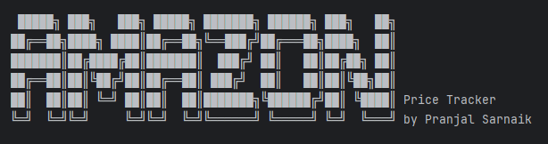
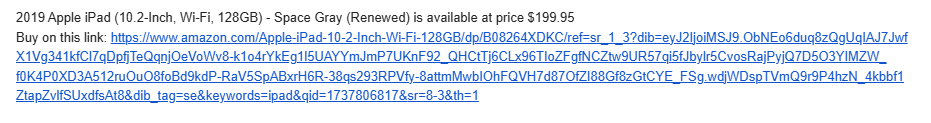
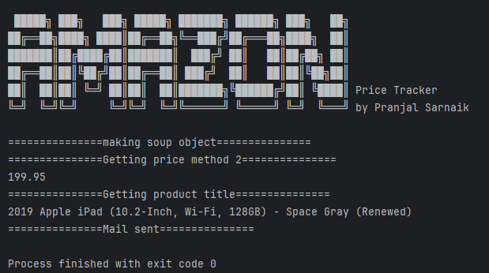

# Amazon Price Tracker
This project tracks Amazon product prices and sends an email alert if the price drops below a set target. It scrapes the product title and price using **BeautifulSoup** and sends notifications via **SMTP**.  

## Screenshots
, , 

## Author
Pranjal Sarnaik

## Features
- Scrapes product title and current price from Amazon.  
- Sends email alerts when the price drops below the target.  
- Supports multiple **SMTP** providers (Gmail, Outlook, Yahoo, etc.).  
- Requires minimal setup with **requests**, **BeautifulSoup**, and **smtplib**.  
- Allows easy customization for tracking different products.  

## Level
Intermediate

## Tech Stack
Web Scraping | Automation | SMTP Email Setup | E-commerce Tracking | Python

## How to Run
1. Clone the repo:  
   ```bash  
   git clone https://github.com/pranjalco/Amazon-Price-Tracker.git

2. Set up the following libraries in your Python environment:
   - `requests`
   - `BeautifulSoup` (from `bs4`)
   - `smtplib`
   - `art`

3. Run(Also install required libraries):
    ```bash
   python app.py

**Created by Pranjal Sarnaik**  
*Released under the MIT License*